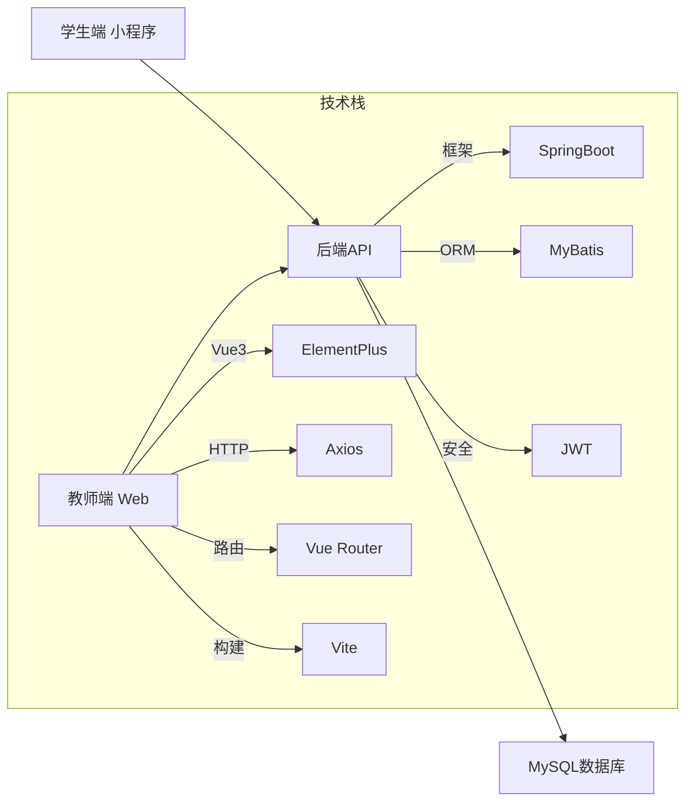
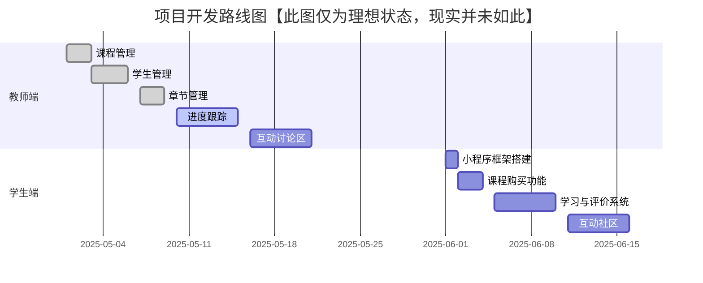

# 企业内部培训管理系统

> 基于Vue3 + SpringBoot的现代化企业培训解决方案

[](https://vuejs.org/)
[](https://spring.io/projects/spring-boot)
[](LICENSE)


## ✨ 系统概述

本系统采用前后端分离架构，为企业提供专业的培训管理解决方案。目前已完成教师端核心功能，学生端小程序正在规划开发中。

### 系统架构



## 🚀 当前功能实现

### 👨‍🏫 教师端功能

- **课程管理**
  - 创建/编辑/删除培训课程
  - 设置课程封面、简介和价格
  - 课程状态管理（上架/下架）
- **学生管理**
  - 学员信息管理（姓名、部门、联系方式）
  - 学员学习进度跟踪
  - 学员分组管理
- **章节管理**
  - 课程章节创建与排序
  - 章节内容编辑（文本/视频/资料）
  - 章节学习时长设置

### 🔜 即将实现功能

- **教师端**
  - 学生进度可视化分析
  - 课程互动讨论区（支持回复）
  - 学习报告生成与导出
- **学生端小程序**
  - 课程浏览与购买
  - 章节学习与进度跟踪
  - 课程评价与评分
  - 互动讨论社区
  - 个人学习中心

## 🛠️ 技术栈

| 组件         | 技术选型                                    |
| :----------- | :------------------------------------------ |
| **前端**     | Vue 3, ElementPlus, Axios, Vue Router, Vite |
| **后端**     | SpringBoot 3.x, MyBatis, JWT, MySQL 8.0     |
| **开发工具** | IntelliJ IDEA, VS Code, Postman, Git        |

## 🚀 快速开始

### 前端启动

```
cd ../frontend

# 安装依赖
npm install

# 启动开发服务器
npm run dev

# 访问应用
http://localhost:5173
```

### 后端启动

```
# 克隆仓库
git clone https://github.com/yourusername/enterprise-training-system.git
cd enterprise-training-system/backend

# 配置数据库
# 1. 创建MySQL数据库: training_system
# 2. 导入sql/init.sql

# 修改配置文件
# src/main/resources/application.yml

# 构建并运行
./mvnw spring-boot:run

# 访问Swagger文档
http://localhost:8080/swagger-ui/index.html
```



## 🤝 如何贡献

欢迎通过Issue提交建议或通过Pull Request贡献代码：

1. **提交Issue**
   - 报告Bug或提出功能建议
   - 标注`bug`或`enhancement`标签
2. **代码贡献**

```
# 创建开发分支
git checkout -b feature/your-feature

# 提交代码
git commit -m "feat: 添加新功能"

# 推送分支
git push origin feature/your-feature
```

3. 创建 **Pull Request** 并描述变更内容

## 📄 许可证

本项目采用 [MIT 许可证](https://license/) - 详情请参阅许可证文件。

------

## 📬 联系我们

**项目支持**
[clickhere@88.com](https://www.nekowalker.cn/)

**问题反馈**
[提交Issue](https://github.com/HighToward/Training-manage-system/issues)
